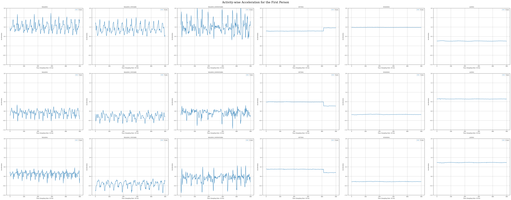
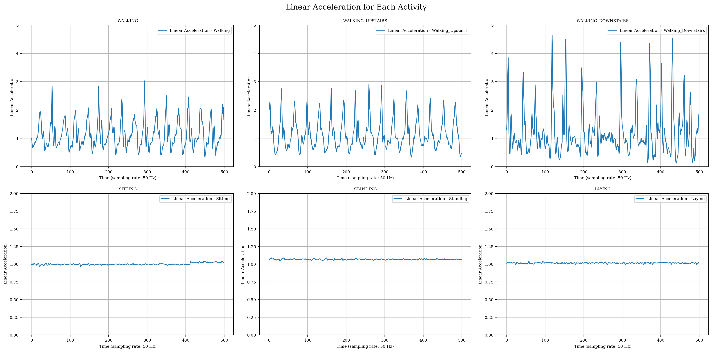
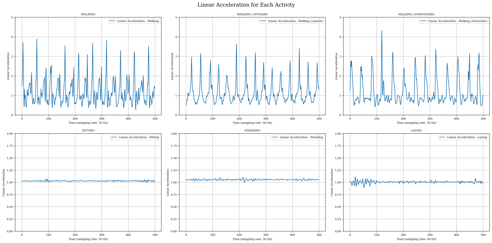
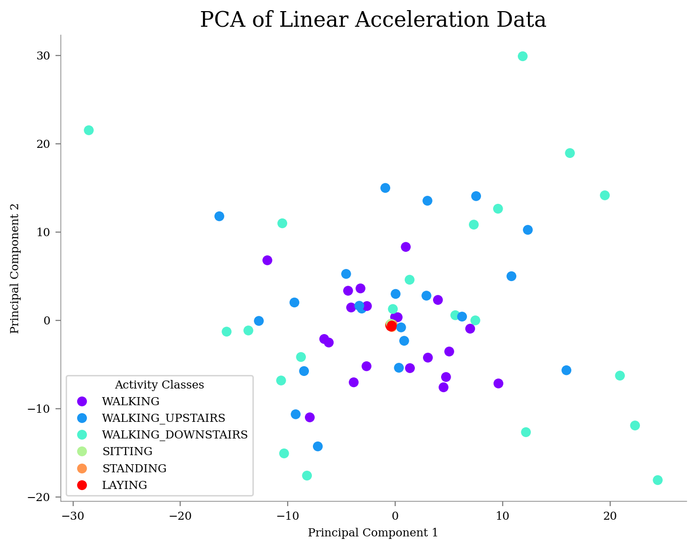
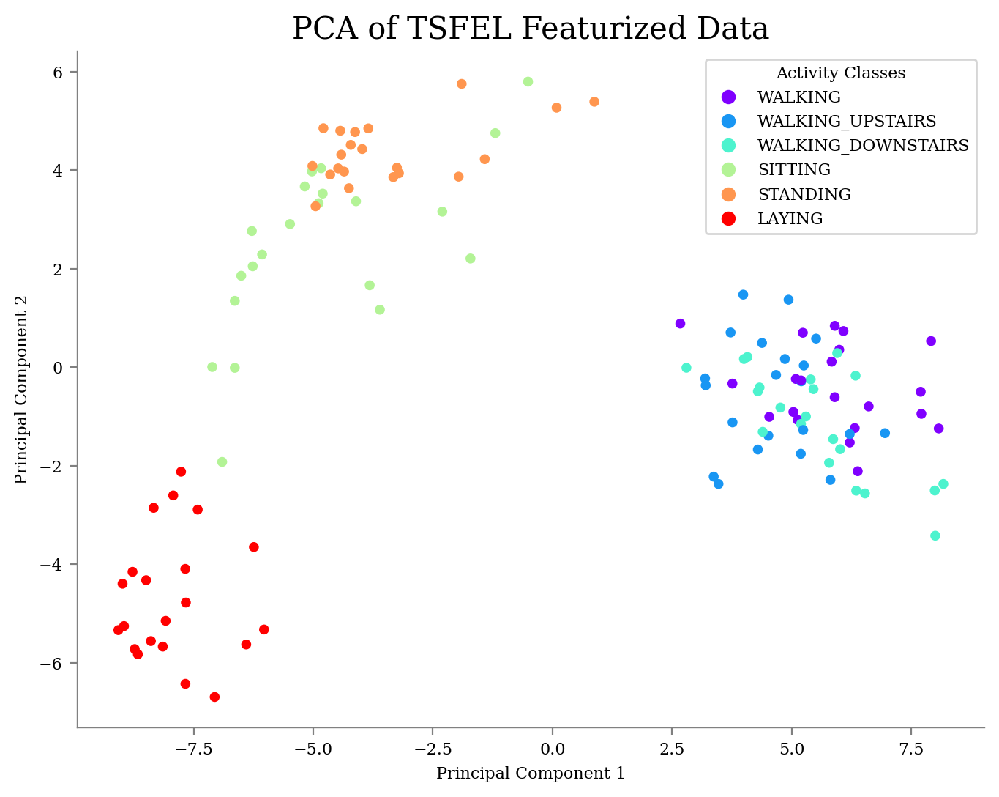
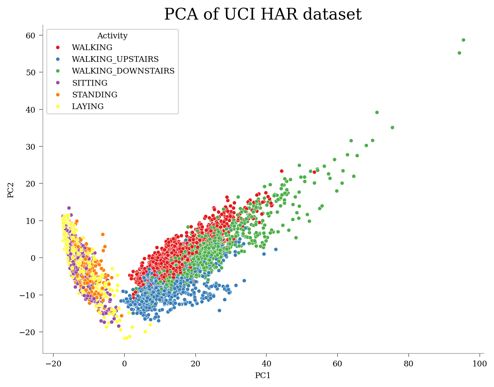
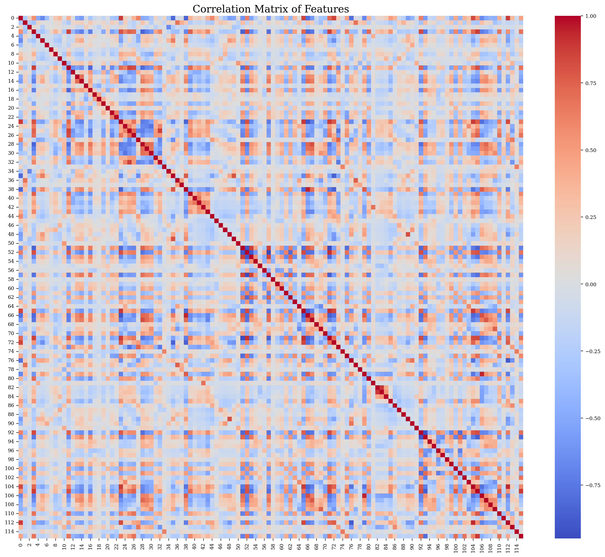
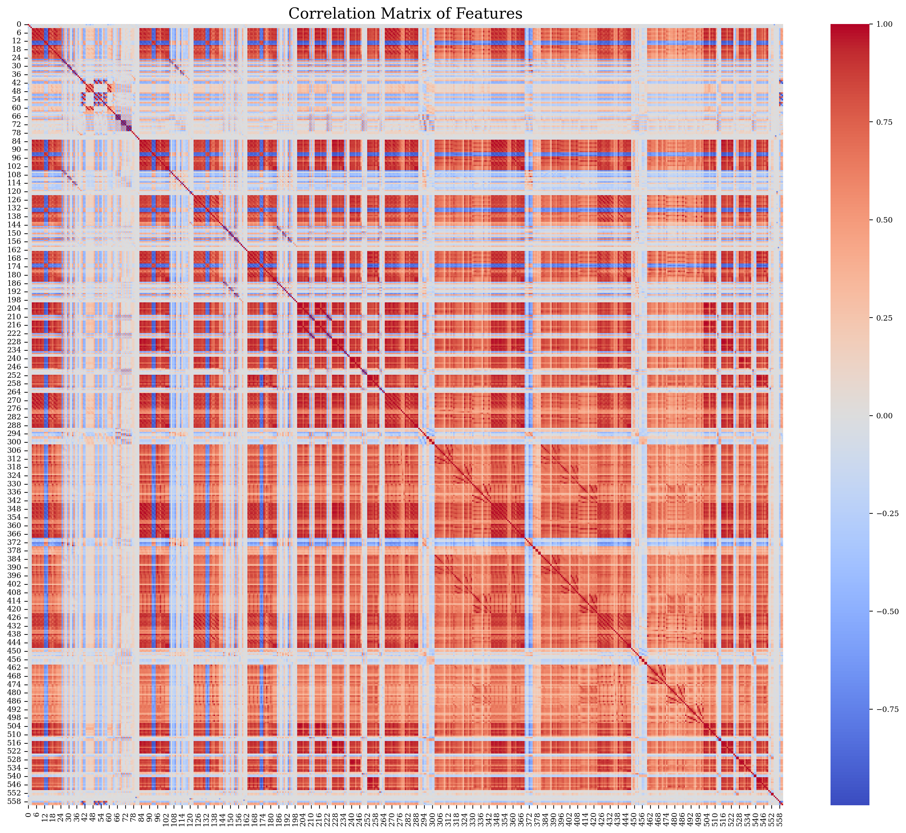

## Task 1 : Exploratory Data Analysis (EDA)

### Q1. Plot the waveform for one sample data from each activity class. Are you able to see any difference/similarities between the activities? You can plot a subplot having 6 columns to show differences/similarities between the activities. Do you think the model will be able to classify the activities based on the data?
Ans : 
The following 6x3 subplot shows the accelerometer data for the first subject from training data:

We observe that different activities exhibit noticeable differences in their directional waveforms. The range of acceleration and the frequency of peaks vary across the activities.   
In the plots, walking, walking upstairs, and walking downstairs show multiple peaks in their waveforms, whereas activities like standing, sitting, and laying have much smoother waveforms. This smoother pattern occurs because the person isn’t moving much, so the acceleration remains relatively constant. Therefore, it is possible to distinguish between static and dynamic activities just by observing these graphs. However, differentiating between individual activities within the dynamic or static categories by simply looking at the graphs is challenging.   
When using a decision tree on raw time-series data, the model may not perform well. This is because the model considers the acceleration at each point in time as a feature and attempts to use that value to decide the split. However, if the waveform is time-shifted, the value at a particular time changes, which could lead to a completely different prediction.    
Since decision tree models do not account for the order of data, which is crucial for understanding the activities, their performance might be poor.However, if we transform this data into features such as mean_acc_x and std_dev_x, we may have a better chance at classifying the activities. For instance, the model could more easily distinguish between static and dynamic activities by examining the standard deviation in any axis. While we may observe patterns in dynamic activities like walking, it may still be challenging to differentiate between walking and walking upstairs, as both are dynamic and have similar waveforms.

### Q2. Do you think we need a machine learning model to differentiate between static activities (laying, sitting, standing) and dynamic activities(walking, walking_downstairs, walking_upstairs)? Look at the linear acceleration $(\text{acc}_x^2 + \text{acc}_y^2 + \text{acc}_z^2)$ for each activity and justify your answer.

Ans :  We have calculated the linear acceleration for each activity using $(\text{acc}_x^2 + \text{acc}_y^2 + \text{acc}_z^2)$ . Below are the plots of linear acceleration for each activity of the first 2 subjects.

Linear acceleration data for subject 1

Linear acceleration data for subject 2

No, we don't need a machine learning model to differentiate between static activities (laying, sitting, standing) and dynamic activities (walking, walking downstairs, walking upstairs). We can visually distinguish between static and dynamic activities by looking at the minimum and maximum values of linear acceleration in the graphs.   
The linear acceleration for static activities is almost constant at around 1(1g), while for dynamic activities, it continuously varies with higher peaks. Thus , we can predict the activity using simple conditional statements based on the maximum and minimum acceleration values whether an activity is static or dynamic.

### Q3. Visualize the data using PCA.
1. Use PCA (Principal Component Analysis) on Total Acceleration $(\text{acc}_x^2 + \text{acc}_y^2 + \text{acc}_z^2)$  to compress the acceleration timeseries into two features and plot a scatter plot to visualize different class of activities.
2. Next, use TSFEL (a featurizer library) to create features (your choice which ones you feel are useful) and then perform PCA to obtain two features. Plot a scatter plot to visualize different class of activities.
3. Now use the features provided by the dataset and perform PCA to obtain two features. Plot a scatter plot to visualize different class of activities.
4. Compare the results of PCA on Total Acceleration, TSFEL and the dataset features. Which method do you think is better for visualizing the data?

Ans:
1. Total Acceleration :

   

    The scatter plot for PCA on Total Acceleration (computed as ($\sqrt{\text{acc}_x^2 + \text{acc}_y^2 + \text{acc}_z^2}$ ) shows significant overlap among static activities (sitting, standing, laying) around the origin (approximately at (0, 0)).  
    This overlap occurs because static activities have almost constant linear acceleration close to 1 g, leading to minimal variability in the Total Acceleration feature. As a result, PCA projects these nearly constant values to a central point (0,0) in the principal component space, causing clustering. In contrast, dynamic activities (walking, walking upstairs, walking downstairs) exhibit greater variability in acceleration x,y ,z, causing them to be more dispersed across the principal component space. This dispersion reflects their higher variability and different movement patterns.

2. TSFEL Features:

   

   The scatter plot for PCA on features extracted using TSFEL shows that static activities (sitting, standing, laying) are more clearly separated.    
   This separation is due to TSFEL extracting a variety of features that capture different aspects of the data, such as mean on each axis, which better differentiate between static activities. Dynamic activities, however, still exhibit some overlap. This is likely because TSFEL features, while more informative than raw Total Acceleration, may not fully capture the nuances between different dynamic activities (walking, walking upstairs, walking downstairs), leading to partial overlap.

3. Original Dataset Features:

  

   The scatter plot for PCA on the original dataset features reveals that static and dynamic activities can still be distinguished. However, there is considerable overlap among dynamic activities (walking, walking upstairs, walking downstairs), indicating that their clusters are not as distinct as expected.   
   This overlap might be due to the original features not sufficiently capturing the distinct characteristics of each dynamic activity or because the dynamic activities themselves have similar patterns of acceleration and thus are close to each other in the feature space.

4. 
   1. **Total Acceleration:**
      - The scatter plot for PCA on Total Acceleration (computed as $(\sqrt{acc_x^2 + acc_y^2 + acc_z^2 })$) shows significant overlap among static activities (sitting, standing, laying) around the origin (approximately at (0, 0)).
      - This overlap occurs because static activities have almost constant linear acceleration close to 1 g, leading to minimal variability in the Total Acceleration feature. As a result, PCA projects these nearly constant values to a central point (0,0) in the principal component space, causing clustering. In contrast, dynamic activities (walking, walking upstairs, walking downstairs) exhibit greater variability in acceleration x,y ,z, causing them to be more dispersed across the principal component space. This dispersion reflects their higher variability and different movement patterns.

   2. **TSFEL Features:**
      - The scatter plot for PCA on features extracted using TSFEL shows that static activities (sitting, standing, laying) are more clearly separated.
      - This separation is due to TSFEL extracting a variety of features that capture different aspects of the data, such as mean on each axis,  which better differentiate between static activities. Dynamic activities, however, still exhibit some overlap. This is likely because TSFEL features, while more informative than raw Total Acceleration, may not fully capture the nuances between different dynamic activities (walking, walking upstairs, walking downstairs), leading to partial overlap.

   3. **Original Dataset Features:**
      - The scatter plot for PCA on the original dataset features reveals that static and dynamic activities can still be distinguished. However, there is considerable overlap among dynamic activities (walking, walking upstairs, walking downstairs), indicating that their clusters are not as distinct as expected.
      - This overlap might be due to the original features not sufficiently capturing the distinct characteristics of each dynamic activity or because the dynamic activities themselves have similar patterns of acceleration and thus are close to each other in the feature space.

### Conclusion
- **Total Acceleration** struggles with distinguishing among  activities,static activities are collapsed to a point ,wheareas dynamic activities are dispersed with no clear pattern.
- **TSFEL Features** offer better differentiation between static and dynamic activities ,provides clear differentitation between sitting,standing and laying .Shows some separation among dynamic activities, though overlap remains.
- **Original Dataset Features** also helps in distinguishing static from dynamic activities but with significant overlap among dynamic classes.

Overall, **TSFEL features** seem to provide the most informative representation for visualizing the data, as they offer a clearer boundary between static and dynamic activities and show some separation among dynamic activities.

### Q4. Calculate the correlation matrix of the features obtained by TSFEL and provided in the dataset. Identify the features that are highly correlated with each other. Are there any redundant features?
Ans: 
Below is the correlation matrix of features obtained from TSFEL data. It has 30 highly correlated features. 

Below is the correlation matrix of 561 feautres obtained from the UCI HAR dataset. It has 338 highly correlated features.

In a correlation matrix:

Red: Strong positive correlation (close to +1).

White: Little to no correlation (close to 0).

Blue: Strong negative correlation (close to -1).

Redundant features are those with high correlation (strong red or blue), as they provide similar information and can be removed to avoid multicollinearity.