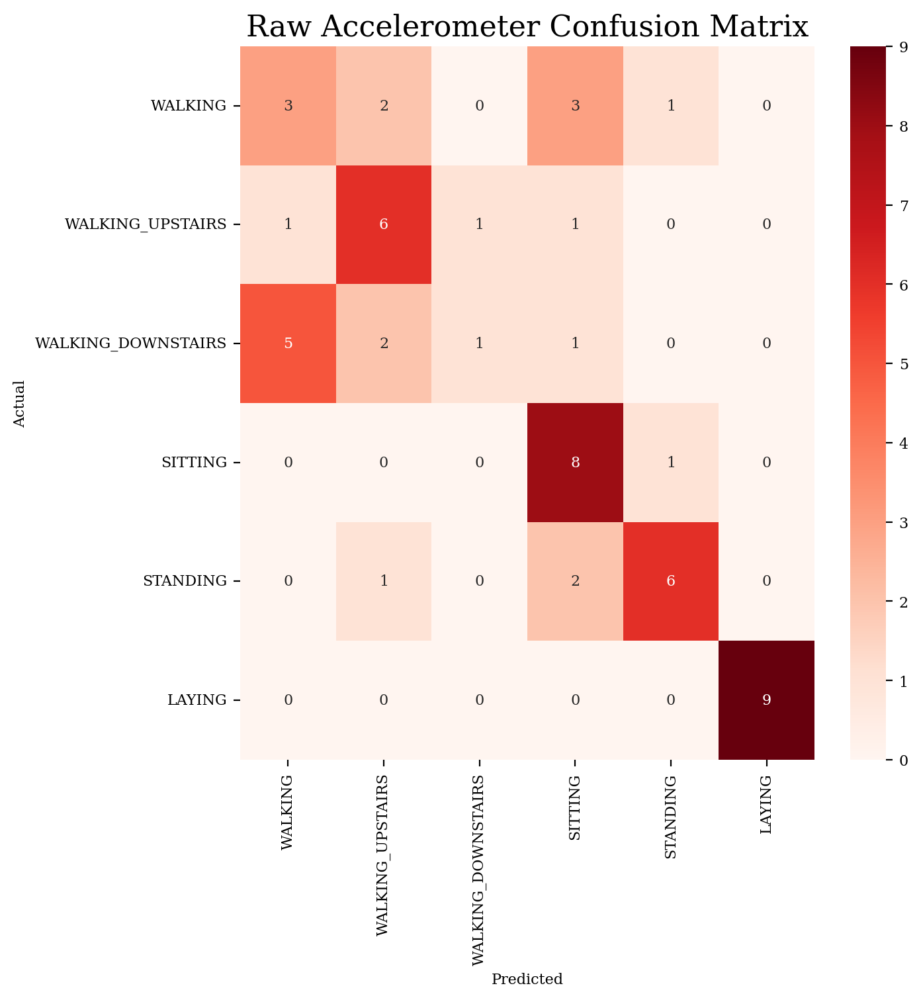
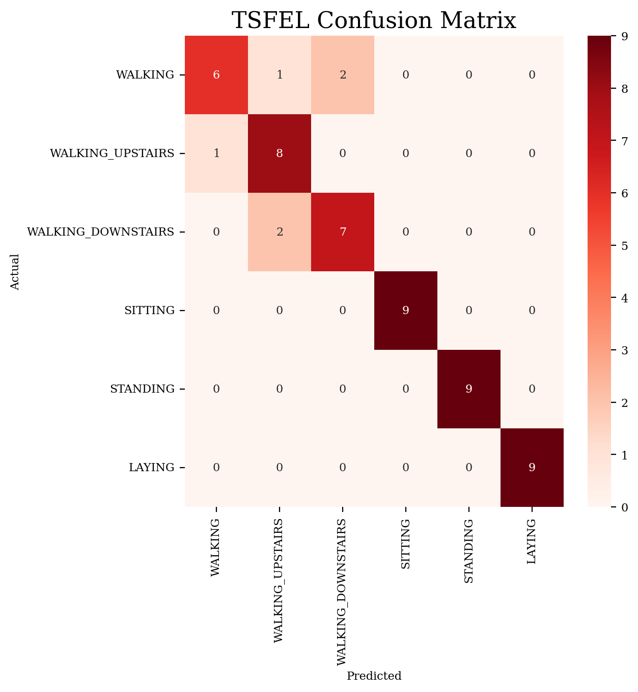
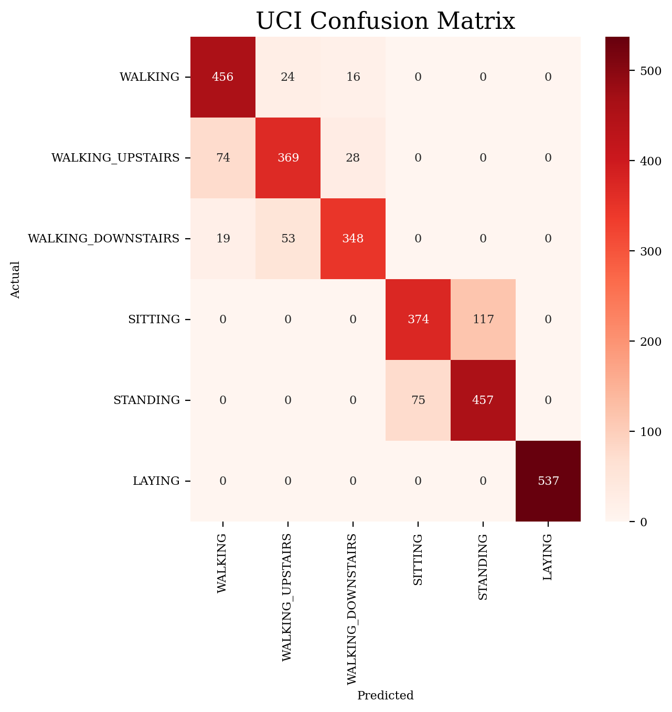
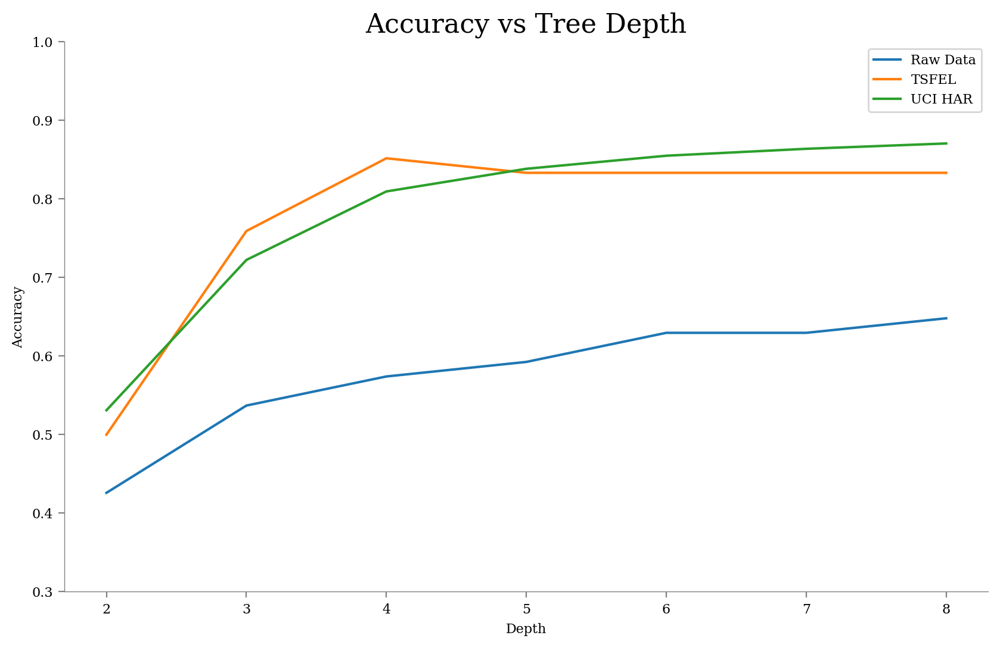
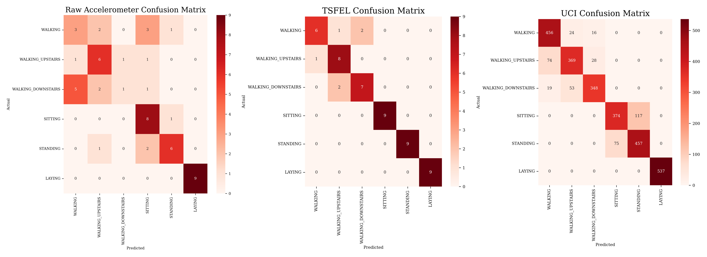

## Task 2 : Decision Trees for Human Activity Recognition ##

### Q1. Use Sklearn Library to train Decision Tress.
1. Train a decision tree model using the raw accelerometer data. Report the accuracy, precision, recall and confusion matrix of the model.
2. Train a decision tree model using the features obtained by TSFEL. Report the accuracy, precision, recall and confusion matrix of the model.
3. Train a decision tree model using the features provided in the dataset. Report the accuracy, precision, recall and confusion matrix of the model.
4. Compare the results of the three models. Which model do you think is better? 

Ans:      
Here is the accuracy, precision, recall and confusion matrix of the model trained on the raw accelerometer data. 

Accuracy:  0.6111111111111112   
Precision:  0.6103535353535353   
Recall:  0.611111111111111   
Confusion matrix: 

Here is the accuracy, precision, recall and confusion matrix of the model trained on the features obtained by TSFEL.  

Accuracy:  0.8888888888888888   
Precision:  0.8936988936988937   
Recall:  0.8888888888888888   
Confusion matrix: 

Here is the accuracy, precision, recall and confusion matrix of the model trained on the features provided in the dataset.   

Accuracy:  0.8622327790973872    
Precision:  0.8624733067496783   
Recall:  0.8586831847358827   
Confusion matrix: 

On comparing the results of the 3 models shown above, the model that uses tsfel features performs the best having accuracy of around 88.89%, then comes the model which uses the features provided in UCI-HAR dataset with an accuracy of 86.22% and model that uses raw accelerometer data performs the worst with an accuracy of 61.11%.   
This clearly shows that pre-precoessing of the data helps significantly in improving the performance of the model.

### Q2. Train Decision Tree with varying depths (2-8) using all above 3 methods. Plot the accuracy of the model on test data vs the depth of the tree.    
Ans:   
Below is the accuracy for each depth of decision tree trained on raw accelerometer data. 

    Accuracy for depth 2:  0.4259   
    Accuracy for depth 3:  0.537   
    Accuracy for depth 4:  0.5741   
    Accuracy for depth 5:  0.5926   
    Accuracy for depth 6:  0.6296   
    Accuracy for depth 7:  0.6296   
    Accuracy for depth 8:  0.6481   

Below is the accuracy for each depth  of decision tree trained on the features obtained by TSFEL.

    Accuracy for depth 2:  0.5
    Accuracy for depth 3:  0.7593
    Accuracy for depth 4:  0.8519
    Accuracy for depth 5:  0.8333
    Accuracy for depth 6:  0.8333
    Accuracy for depth 7:  0.8333
    Accuracy for depth 8:  0.8333

Below is the accuracy for each depth  of decision tree trained on the features provided in the dataset.

    Accuracy for depth 2:  0.531
    Accuracy for depth 3:  0.7224
    Accuracy for depth 4:  0.8096
    Accuracy for depth 5:  0.8385
    Accuracy for depth 6:  0.8551
    Accuracy for depth 7:  0.8639
    Accuracy for depth 8:  0.8707

Below is the graph of Depth VS Accuracy of all the 3 decision trees. 

### Q3. Are there any participants/ activitivies where the Model performace is bad? If Yes, Why?

Model trained using Raw Accelerometer Data : The model trained using raw accelerometer data performs poorly compared to the other 2 models. From the confusion matrix, we can observe that it struggles to distinguish between dynamic activities like WALKING, WALKING_UPSTAIRS and WALKING_DOWNSTAIRS. It also faces some confusion between SITTING and STANDING. This is because the raw accelerometer data has only 3 features, which is causing the model to underfit. This can be solved by including more features (for example, by using the TSFEL featurization).

Model trained using TSFEL Features : The model trained using th 1152 features extracted through TSFEL, performs the best among the three, accuracy-wise. It is able to classify all the static activities with 100% accuracy and also classifies dynamic activities with minimal confusion. This is because the TSFEL features, which are derived through automated processes, provide a set of distinctive features that enable accurate differentiation between various activities.

Model trained on UCI Dataset : The model trained using the 561 features provided by the UCI HAR dataset, performs almost as good as the TSFEL model. It faces confusion while classifying the dynamic activities similar to the TSFEL model, but it also faces some confusion while classifying between SITTING and STANDING activties. But its performance is sitll impressive as it is able to perform as good as the TSFEL model with just 3-4% accuracy drop and whilst using half the features compared to TSFEL.