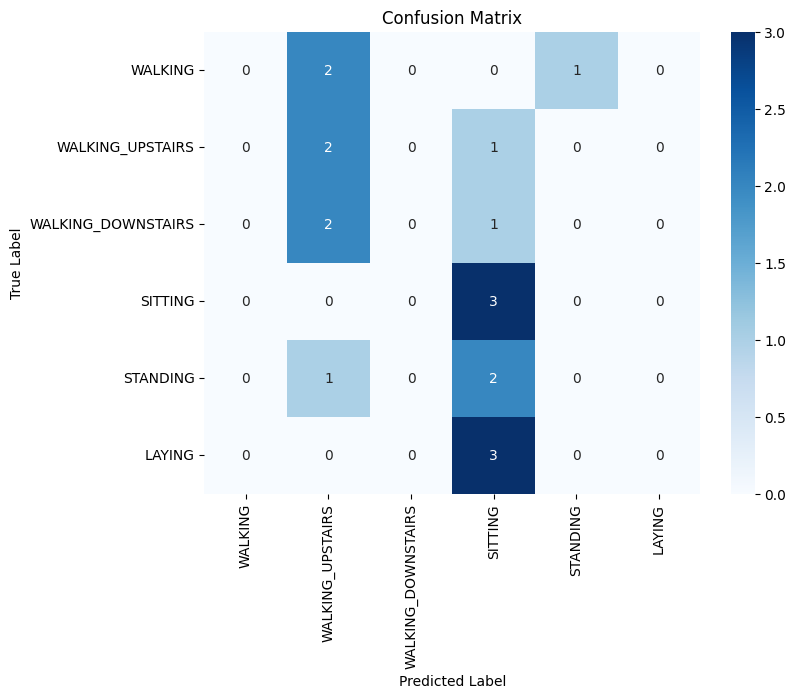
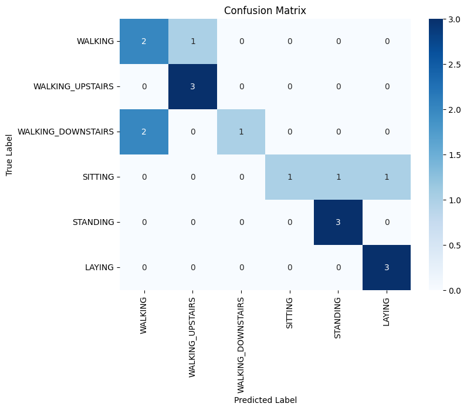
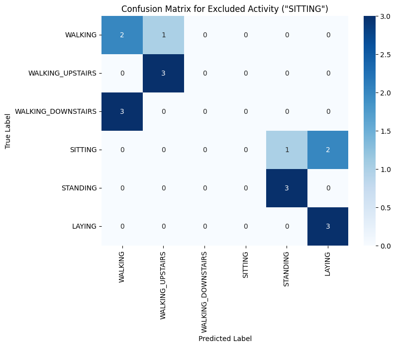

## Task 3 : Prompt Engineering for Large Language Models (LLMs)

### Q1. Demonstrate how to use Zero-Shot Learning and Few-Shot Learning to classify human activities based on the featurized accelerometer data. Qualitatively demonstrate the performance of Few-Shot Learning with Zero-Shot Learning. Which method performs better? Why? 
Ans :

ZSL : Accuracy: 0.28

FSL : Accuracy: 0.72

In Zero-Shot Learning, the LLM tends to classify activities predominantly as either walking upstairs or sitting. While it correctly identifies sitting, it struggles to distinguish between other activities.

In contrast, with Few-Shot Learning, the LLM can more accurately classify activities as either static or dynamic.Specifically:

WALKING, WALKING_UPSTAIRS, STANDING, and LAYING show improved accuracy, with fewer misclassifications compared to the zero-shot method.
SITTING,WALKING_DOWNSTAIRS still has some misclassifications, but overall, it performs better in the few-shot scenario.
Reason: Few-shot learning has an advantage because it provides the model with a small number of labeled examples(here 12). This allows the model to adapt and learn from these samples, leading to better classification accuracy.

On the other hand, zero-shot learning solely relies on the model's generalization capabilities without seeing any examples. It doesn't learn anything new but rather predicts based on its prior knowledge, which may not be entirely relevant to the experimental conditions, resulting in more misclassifications.

Conclusion : Few-shot learning outperforms zero-shot learning as it provides better context for making accurate predictions.

### Q2. Quantitatively compare the accuracy of Few-Shot Learning with Decision Trees (You may use a subset of the test set if you encounter rate-limiting issues). Which method performs better? Why?
Ans : 
Few-Shot Learning Accuracy: 0.72  
Decision Tree Accuracy (Trained on Same Data as Few-Shot Learning): 0.77   
Decision Tree Accuracy (Trained on Entire Training Data): 0.94  

Few-Shot Learning vs. Decision Tree (Same Data as Few-Shot Learning):  
The Decision Tree, when trained on the same limited data (12 samples) provided to the LLM for Few-Shot Learning, achieves an accuracy of 0.77. While the accuracy is slightly higher than Few-Shot Learning, the Decision Tree struggles to classify "Walking Downstairs" as static or dynamic.   
Wheareas ,the Few-Shot Learning model shows strong differentiation between static and dynamic activities, with no inter-category misclassifications, though it still shows some internal confusion between "Walking Downstairs" and "Sitting."

Few-Shot Learning vs. Decision Tree (Entire Training Data):
Accuracy: When trained on the entire dataset, the Decision Tree achieves a much higher accuracy of 0.94. The model demonstrates improved performance, with only one misclassification, where "Walking Downstairs" is incorrectly predicted as "Walking."

To conclude , while Few-Shot Learning is effective with limited data, the Decision Tree model, given sufficient data, outperforms it in terms of overall accuracy.

### Q3. What are the limitations of Zero-Shot Learning and Few-Shot Learning in the context of classifying human activities based on featurized accelerometer data?  
Ans :  Limitations of Zero-Shot Learning and Few-Shot Learning in Classifying Human Activities
 
Zero-Shot Learning (ZSL) :

Lack of Detailed Classification : Zero-Shot Learning may struggle to classify activities accurately if the descriptions used are not detailed enough. This can lead to confusion between similar activities.   
Dependence on Description Quality : The success of Zero-Shot Learning depends on how well the descriptions or attributes of activities are defined. Poorly defined attributes can lead to incorrect classifications.   
Limited to Known Attributes : ZSL models can only classify activities based on the attributes they have been trained on. If an activity does not fit well within these predefined attributes, it may be misclassified.   
Difficulty with Complex Activities : Activities that are complex or involve multiple elements can be challenging for Zero-Shot Learning models, which may not capture all the nuances of such activities.   
Potential for Misclassification : If attributes overlap between different activities, Zero-Shot Learning models might misclassify activities, leading to reduced accuracy.

Few-Shot Learning (FSL) :

Dependence on Data Quality : Few-Shot Learning models require high-quality examples to perform well. If the provided examples are not clear or accurate, the model’s performance will suffer.   
Limited Example Diversity : The effectiveness of Few-Shot Learning depends on having diverse examples. If the examples do not represent the full range of an activity, the model may not generalize well to new data.   
Risk of Overfitting : With very few examples, there is a risk that the model might overfit, meaning it learns to memorize the examples rather than generalize from them.  
Class Imbalance Issues : Few-Shot Learning can have difficulty if some activities are underrepresented in the examples. Ensuring that each activity is represented well in the examples is important but challenging.  
Need for Representative Examples : The quality of Few-Shot Learning depends on how representative the examples are. If the examples do not fully capture the characteristics of the activities, the model’s performance will be affected.

In summary, both Zero-Shot Learning and Few-Shot Learning have limitations that can impact their effectiveness in classifying human activities based on featurized accelerometer data. Addressing these limitations involves ensuring high-quality and representative examples and detailed descriptions.

### Q4. What does the model classify when given input from an entirely new activity that it hasn't seen before? 
Ans : For test cases where the true label is "SITTING," the model often predicts other activities, like "STANDING" or "LAYING," instead of "SITTING."

Not including "SITTING" in the few-shot examples may have made the model less familiar with this activity. As a result, it ends up classifying the sample as whatever activity it thinks is closest.

### Q5. Test the model with random data (ensuring the data has the same dimensions and range as the previous input) and report the results. 
Ans : 
Random Data Shape:  (6, 20)   
Predicted label for the random query input: 2  
Predicted label for the random query input: 6  
Predicted label for the random query input: 3  
Predicted label for the random query input: 3  
Predicted label for the random query input: 6  
Predicted label for the random query input: 2

The results indicate that the LLM is able to classify random, nonsensical data as well, suggesting that the model is generating classifications regardless of the meaningfulness of the input. This highlights a potential issue where the model may not be differentiating between valid and invalid input data.