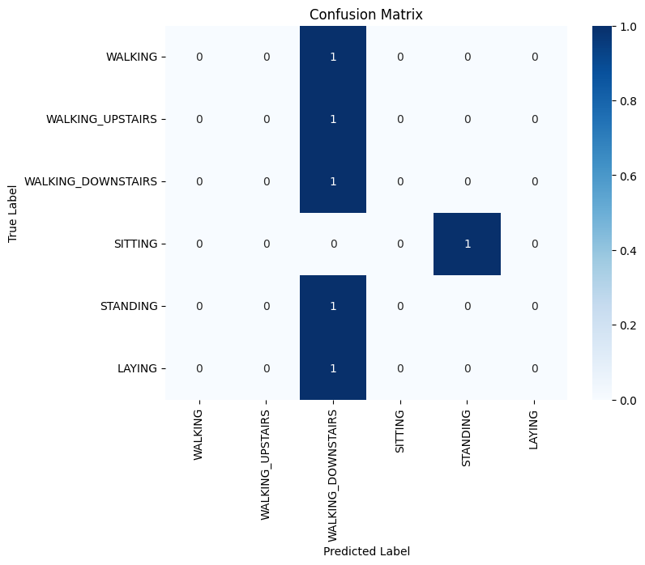
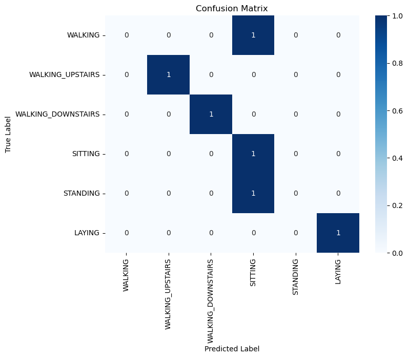

## Task 4 : Data Collection in the Wild 

### Q1. Use the Decision Tree model trained on the UCI-HAR dataset to predict the activities that you performed. Report the accuracy, precision, recall and confusion matrix of the model. You have three version of UCI dataset you can use a)Raw data from accelerometer, b)TSFEL featurised data, c)Features provided by author. Choose which version to use, ensuring that your test data is similar to your training data. How did the model perform? 
Ans : We have done pre processing on the data we collected and plotted the graphs below. 
We had held phone in the vertical orientation, and the UCI HAR data was recorded in horizontal orientation. So we exchnaged the axes accordingly. 

Raw Data Decision Tree :   
Accuracy:  0.5416666666666666   
Precision:  0.5416666666666666   
Recall:  0.5416666666666666   

TSFEL Decision Tree : 

UCI HAR Data : 
We cant use the decision tree modelled on 561 feature data provided by the author, because we have only measured x, y, z accelerations and we dont have access to all the other features provided by the author.

### Q2. Use the data you collected to predict the activities that you performed. Decide whether to apply preprocessing and featurization, and if so, choose the appropriate methods. How did the model perform?
Ans : Following are the values we got by :
Training the tree directly on the collected data:
Accuracy:  0.5   
Precision:  0.4166666666666667  
Recall:  0.5  

Applying TSFEL featurization and PCA on the data :   
Accuracy:  0.6666666666666666   
Precision:  0.5555555555555555   
Recall:  0.6666666666666666  

As we can see on applying featurisation (TSFEL), and preprocessing (PCA), we get better results. TSFEL imports more features and providing more features will give distinction in the data and it will help in discribing an activity in better way. 

### Q3. Use the Few-Shot prompting method using UCI-HAR dataset to predict the activities that you performed. Ensure that both your examples and test query undergo similar preprocessing. How did the model perform? 
Ans : Accuracy: 0.17
We have used different equipments, hence there is difference in orientation. That is why we are getting bad accuracy. 

### Q4. Use the Few-Shot prompting method using the data you collected to predict the activities that you performed. Adopt proper processing methods as needed. How did the model perform? 
Ans : The model had an accuracy of 0.67 out of 1 or 67% overall. Below is the confusion matrix for the model using the data we collected. 

Key factors that could contribute to this performance:

Limited Number of Examples: The few-shot approach relies on a small set of examples, which may not provide enough context for the model to accurately distinguish between similar activities.

Limited number of test dataset: Testing on one sample for each activity is not enough , as that one sample may be an outlier.

