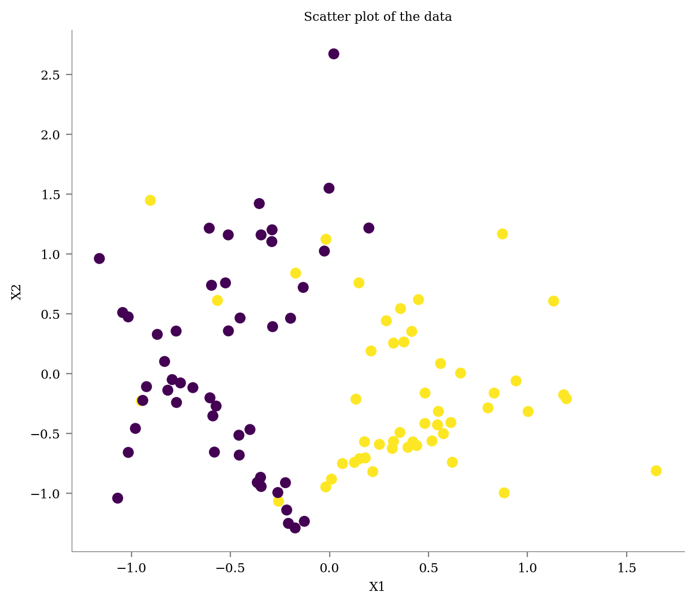
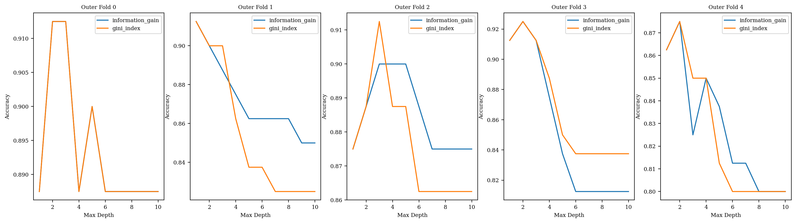
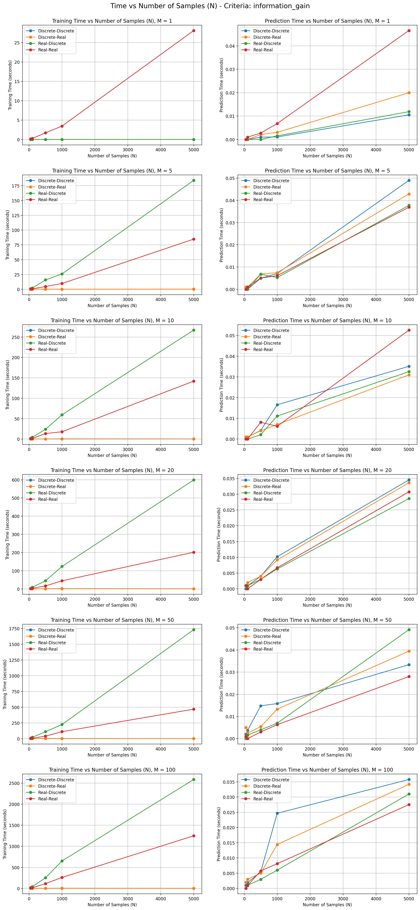
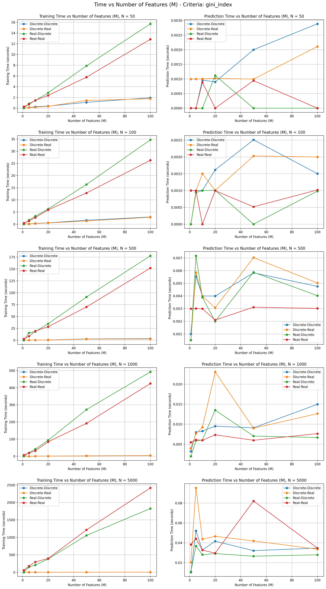
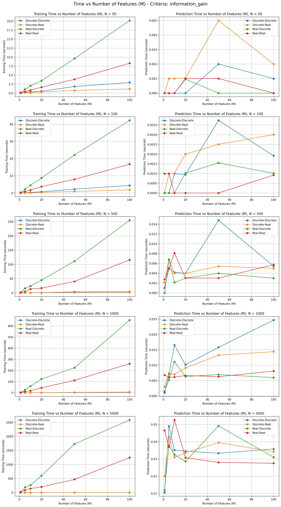
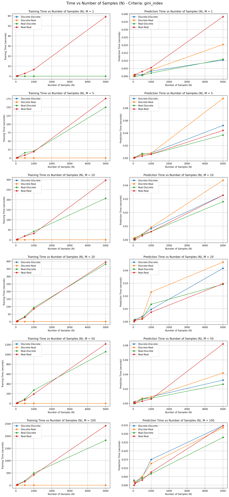

## Task 5 : Decision Tree Implementation

### Q1. Complete the decision tree implementation in tree/base.py. The code should be written in Python and not use existing libraries other than the ones shared in class or already imported in the code. Your decision tree should work for four cases: i) discrete features, discrete output; ii) discrete features, real output; iii) real features, discrete output; iv) real features, real output. Your model should accept real inputs only (for discrete inputs, you may convert the attributes into one-hot encoded vectors). Your decision tree should be able to use InformationGain using Entropy or GiniIndex as the criteria for splitting for discrete output. Your decision tree should be able to use InformationGain using MSE as the criteria for splitting for real output. Your code should also be able to plot/display the decision tree. 
Ans : We have successfully implemented the decision tree implementation in tree/base.py as per the assignment requirements. Our decision tree supports the following cases:

1. Discrete features, discrete output
2. Discrete features, real output
3. Real features, discrete output
4. Real features, real output   

Completed files:     
tree/base.py : Contains the completed    
DecisionTree class. tree/utils.py : Contains utility functions needed for the decision tree.       
metrics.py: Includes all required performance metrics functions.      

Our decision tree implementation displays the decision tree structure through properly formatted text as per the format shown in tree/base.py. We have also included the functionality of plotting the decision tree using Graphviz. Please run the usage.py file to verify our decision tree implementation and check the results.

### Q2. Generate your dataset using the following lines of code. 
### a) Show the usage of your decision tree on the above dataset. The first 70% of the data should be used for training purposes and the remaining 30% for test purposes. Show the accuracy, per-class precision and recall of the decision tree you implemented on the test dataset. 
### b) Use 5 fold cross-validation on the dataset. Using nested cross-validation find the optimum depth of the tree. 

Ans : We created the dataset using the code provided. This is the Scatter plot of the data.    
Shape of X: (100, 2)   
Shape of y: (100,)

Now we have split the data as 7-% for training and remaining 30% for testing purposes.     
Shape of X_train: (70, 2)   
Shape of X_test: (30, 2)   
Shape of y_train: (70,)  
Shape of y_test: (30,)  

Here is the accuracy, per-class precision and recall of the decision tree we implemented on the test dataset.   

Criteria : Information Gain   
Accuracy : 0.8667   
Precision for class 0 : 0.75   
Recall for class 0 : 0.9   
Precision for class 1 : 0.9444   
Recall for class 1 : 0.85

Here are the accuracies for each of the k-fold cross validation:  
Fold 0 Accuracy : 0.8   
Fold 1 Accuracy : 0.9   
Fold 2 Accuracy : 0.85   
Fold 3 Accuracy : 0.8   
Fold 4 Accuracy : 0.95  

Mean Accuracy : 0.86

Here we have plotted the outer fold accuracies vs depth for each outer fold   

Now, we calculate the optimal depth for the tree according to each criteria :   
Criterion: information_gain, Mean Best Depth: 2.0   
Criterion: gini_index, Mean Best Depth: 2.0   

From the above graphs and data, we can conclude that 2 is the most optimal depth for the decision tree.

### Q3. a) Show the usage of your decision tree for the automotive efficiency problem. b) Compare the performance of your model with the decision tree module from scikit learn.
Ans : First, we extracted the auto-mpg data.   
Shape of extracted data:  (398, 8)
Then we processed it and split it into train and test dataset. Then we calculated RMSE using our custom decision tree implementation and also the SkLearn's Decision Tree Regressor. Here is the Performance Comparison:   

Our Decision Tree - Train RMSE: 5.7899   
Our Decision Tree - Test RMSE: 7.1421   
Scikit-Learn Decision Tree - Train RMSE: 1.9938   
Scikit-Learn Decision Tree - Test RMSE: 3.2169   

Comparison of Models:   
The performance comparison shows that the Scikit-Learn decision tree outperforms our custom decision tree implementation.   
Our custom decision tree achieved a Train RMSE of 5.7899, while the Scikit-Learn decision tree achieved a significantly lower Train RMSE of 1.9938.   
On the test set, our model resulted in a Test RMSE of 7.1421, compared to 3.2169 from the Scikit-Learn model.    

This shows that the Scikit-Learn model is better at fitting the training data, likely due to more optimized algorithms and better-handling of edge cases. The higher test RMSE for our model indicates that it doesn't generalize to unseen test data as effectively as Scikit-Learn decision tree.

Our implementation, while educational, still provides a relatively reasonable fit and could benefit from further refinement to improve accuracy and reduce overfitting.

### Q4. Create some fake data to do some experiments on the runtime complexity of your decision tree algorithm. Create a dataset with N samples and M binary features. Vary M and N to plot the time taken for : 1) learning the tree, 2) predicting for test data. How do these results compare with theoretical time complexity for decision tree creation and prediction. You should do the comparison for all the four cases of decision trees.

Ans : 

From the above graphs, we can observe that real inputs have much higher prediction times compared to discrete inputs.

The depth of the tree is considered to be order O(log N), which is usually the case, but in the worst case, it might be of order of O(N).

Training Time : The theoretical complexity for training a decision tree is O(M.N.log N), where N is the number of samples, and M is the number of features. The plot results show that training time increases linearly with both M and N, matching the expected O(M.N.log N) complexity. (N.logN graph is almost linear too).

Prediction Time : Theoretical complexity for predicting a single sample is O(depth of the tree). For balanced trees, the depth is typically O(log N). However, this is for the worst case in which the decision for prediction happens at the leaf node located at the bottom of the tree. However, if the decision for prediction gets taken at a leaf node located at a lower depth, then it might be possible that the time taken may be less, even for a higher value of M or N. So, we need to observe the general trend. In this case, it can be seen that prediction time increases with an increase in N but generally remains constant with an increase in M.

The theoretical complexities are consistent with the observed trends in the plotted graphs. The prediction time tends to follow an O(log N) pattern. The prediction time versus M graphs generally appear linear, indicating independence from M, while the prediction time versus N graphs resemble a log N trend.